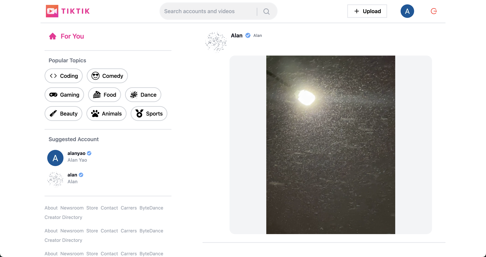

This is a [Next.js](https://nextjs.org/) project bootstrapped with [`create-next-app`](https://github.com/vercel/next.js/tree/canary/packages/create-next-app).

## Getting Started

<!-- Open [https://tiktok-clone-three.vercel.app/](https://tiktok-clone-three.vercel.app/) with your browser to see the result. -->

Skill Insight: 

React, TypeScript, Hooks and Refs, Next.js(include File-base Routing, 

Data fetching, server-side rendering, static generation), 

Sanity(content platform), Zustand(like Redux) and Oauth2.0 by using Google.

